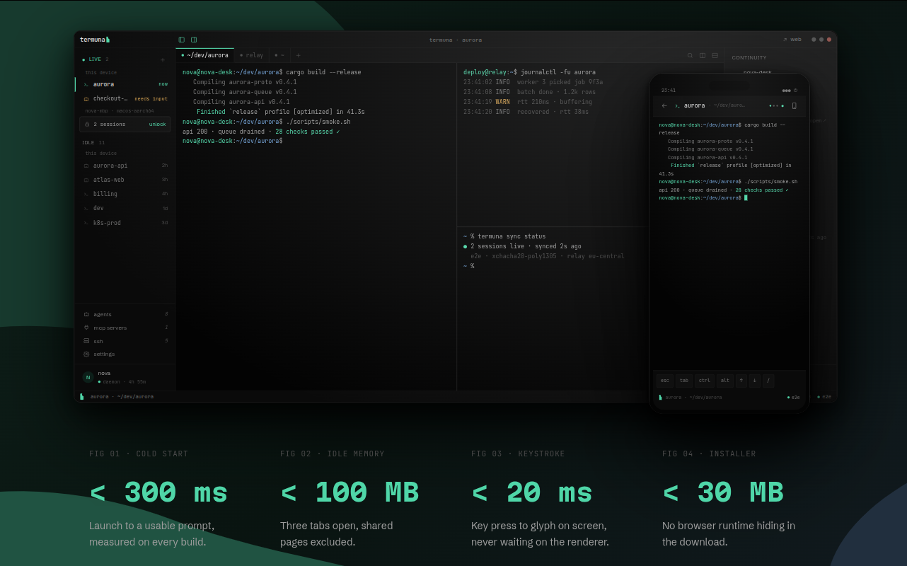

<p align="center">
  
</p>

<h1 align="center">Termuna</h1>

<p align="center">A fast, lightweight terminal whose sessions follow you everywhere.<br>
One session. Every screen.</p>

<p align="center">
  <a href="https://github.com/termuna/termuna/releases/latest"><strong>Download</strong></a> ·
  <a href="https://termuna.com">termuna.com</a> ·
  <a href="https://termuna.com/docs/">Documentation</a> ·
  <a href="https://termuna.com/changelog/">Changelog</a> ·
  <a href="https://github.com/termuna/termuna/issues">Issues</a>
</p>

<p align="center">
  
</p>

## What is Termuna

A GPU-rendered terminal for Linux, Windows, and macOS built around one
idea: your live sessions - tabs, splits, scrollback, running programs -
should survive the window, the reboot, and the machine. Sessions mirror
end-to-end encrypted to Termuna Cloud, so you can continue them from a
browser or phone while the host is up. The relay never sees plaintext.

The local terminal is free forever, works fully offline, and needs no
account. Cloud continuity is the paid part - and export is never held
hostage.

## Highlights

- **Fast, and measured.** Cold start under 300 ms, idle under 100 MB
  with three tabs open, key press to glyph under 20 ms. These are
  budgets, not aspirations: a change that regresses them does not ship.
- **Sessions outlive everything.** The shells live in a small daemon,
  not the window. Close the window, upgrade the app, restart the
  daemon - your shells keep running and the window walks back into
  them. A reboot restores the tree with every working directory
  remembered.
- **Continue from anywhere.** Open a session in the browser or on your
  phone while the host is up. Typing goes back to the real shell.
  Everything is sealed with xchacha20-poly1305 before it leaves your
  machine; the server stores ciphertext it cannot read.
- **Agents are first-class.** Run Claude Code as a managed session: the
  conversation mirrors like any session, and when the agent stops to
  ask permission for a tool call, you can read the exact call and
  approve it from your phone.
- **SSH built in.** Connection profiles live in an encrypted vault,
  unlockable with one passphrase, shareable with a team - also
  end-to-end encrypted, so the server holds only ciphertext.
- **A calm place to work.** Nothing interrupts typing, nothing animates
  for attention, no telemetry without an explicit opt-in. Updates are
  offered as one quiet line: the app checks a signed manifest daily,
  verifies every byte, and on Linux installs the update as a shell
  command that runs in a session in front of you - the terminal is its
  own installer.
- **Servers count too.** A headless build of the daemon joins a
  machine with no screen to your account, ready to host sessions
  (see below).

## Downloads

Grab the latest from the
[releases page](https://github.com/termuna/termuna/releases/latest):

| Platform | File |
|---|---|
| Windows 10/11 (x64) | `termuna-setup-<version>-x64.exe` - per-user installer, no admin needed |
| Linux (x86_64) | `termuna-<version>-linux-x86_64.tar.gz` |
| macOS (Apple silicon) | `Termuna-<version>-arm64.tar.gz` - unzip into `~/Applications` |
| Any machine with no screen | `termuna-daemon-<version>-<target>` - see below |

### A machine you never sit at

A server can hold sessions too. `termuna-daemon` is the same daemon the
app runs, without the window: 10MB instead of 32, no GPU stack, no
display. Join it to your account and it appears beside your laptops,
ready to start sessions on, whether or not anything is running on it.

```sh
install -m755 termuna-daemon ~/.local/bin/
TERMUNA_TOKEN=<a token this account already has> termuna-daemon login
systemctl --user enable --now termuna-daemon
```

The desktop app needs none of this: it starts and owns its own daemon,
as it always has.

## About this repository

This is Termuna's public home for **issue tracking and releases**. The
source code is developed in a private repository while the product is
in early access. Bug reports, feature requests, and questions are very
welcome here - the
[issue tracker](https://github.com/termuna/termuna/issues) is read
daily.

For anything security-sensitive, please mail
[security@termuna.com](mailto:security@termuna.com) instead of opening
a public issue.
